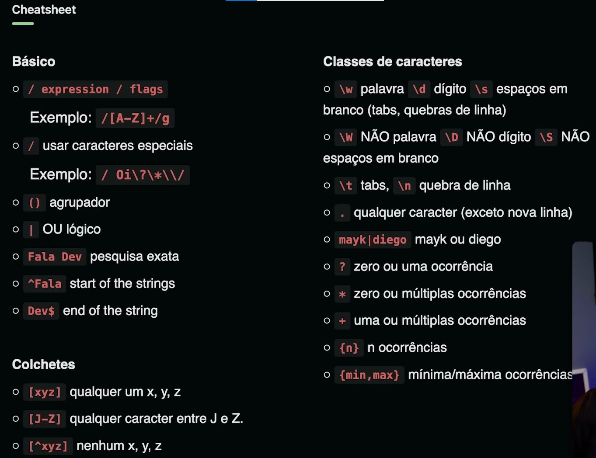

# Rocketpay

## Aula 1

- O que é DOM?
  - Document Object Model
    - Modelagem do documento como objeto JavaScript
  - Representação do HTML em objetos JavaScript
    - Atributos (propriedades) e métodos (funcionalidades)
  - Criado pelo navegador (browser)
    - É uma interface (API) usada no navegador
- Pra que serve?
  - JavaScript usa DOM para se conectar ao HTML
    - DOM não é o JavaScript
  - Manipular o HTML com JavaScript
    - Modificar o HTML, os estilos e até disparar ações

## Aula 2

- IMask
  - [Package](https://www.npmjs.com/package/imask)
  - [Doc](https://imask.js.org/)
  - `npm install imask` and `import IMask from 'imask'`
- Expressões Regulares (Regex com JS)

  - Tecnologia usada para buscar padrões dentro de textos
  - Leitura da esquerda para direita
  - Ler um caractere por vez, um após o outro
  - Conhecer os caracteres reservados da tecnologia
  - Exemplo de criação de Regex no JS:
    - `const re = /foo/`
       
      `const re = new RegExp(/foo/)`
  - Funções usadas em Strings
    - Agrupa em padrões em um array
       
      `const matches = 'aBC'.match(/[A-Z]/g`
       
      //Output: Array [B, C]
       
      //g significa global
    - Pesquisa se existe ou não o padrão
       
      `const index = 'aBC'.search(/[A-Z]/)`
       
      //Output: 1
    - Substitui os padrões por um novo valor
       
      `const next = 'aBC'.replace(/a/, 'A')`
       
      //Output: ABC

  

